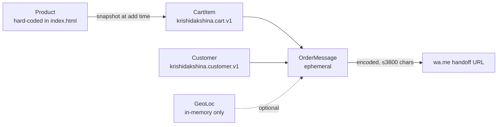

# Phase 1 Data Model: Storefront Baseline (KrishiDakshina v1)

**Feature**: `001-storefront-baseline` · **Plan**: [plan.md](./plan.md) · **Spec**: [spec.md](./spec.md)

This document is the authoritative shape reference for every piece of state the client keeps or transmits. It is **descriptive** of the current implementation in [index.js](../../index.js) and [index.html](../../index.html), and it is the shape that the contracts under [contracts/](./contracts/) enforce. Any change to a field, cap, or transition must go through `/speckit.plan` and, where the change bumps a schema, must bump the versioned `localStorage` key (Principle V clause 3).

## Overview

| Entity | Lifetime | Storage | Cardinality | Reference validator |
|--------|----------|---------|-------------|---------------------|
| `Product` | Build-time constant | Hard-coded in [index.html](../../index.html) product grid | Exactly 12 in v1 | — (author-controlled) |
| `CartItem` | Session + persisted | `localStorage["krishidakshina.cart.v1"]` | ≤ 50 distinct keys | `isValidCartItem` |
| `Customer` | Session + persisted | `localStorage["krishidakshina.customer.v1"]` | 0 or 1 record | `isValidCustomer` |
| `GeoLoc` | In-memory only | Module-scoped `geoLoc` in `index.js` | 0 or 1 | inline (`typeof lat/lng === 'number'`) |
| `OrderMessage` | Ephemeral (per click) | Encoded URL query string | 1 per handoff | length ≤ `MAX_MSG_LEN` |

---

## Entity: `Product`

A single catalog item. Hard-coded in the Products section of [index.html](../../index.html) for v1; there is no admin UI and no product database.

### Fields

| Field | Type | Constraints | Notes |
|-------|------|-------------|-------|
| `name` | string | non-empty; ≤ `MAX_NAME_LEN` (200) | Display name shown on the card and in the WhatsApp message. |
| `category` | string | one of: `Vegetables`, `Dairy & Eggs`, `Leafy Greens`, `Bakery`, `Fruits`, `Dairy`, `Grains`, `Dry Fruits`, `Spices` | Rendered as the card badge; free-form values are allowed but restrict to this list for v1. |
| `description` | string | non-empty; author's discretion | One-line marketing copy under the name. |
| `price` | number | finite; `0 ≤ price ≤ MAX_PRICE` (1 000 000) | INR. Stored as a raw number in the `data-price` attribute on the `+` button. |
| `unit` | string | ≤ `MAX_UNIT_LEN` (50); e.g. `/ kg`, `/ dozen`, `/ 250 g`, `/ litre` | Suffix printed after the price. |
| `imagePath` | string | `product_images/<slug>.(jpg\|webp\|avif)` | Referenced by ``. The folder does **not yet exist** — see [research.md R-9](./research.md#r-9-product-images). |
| `dataFallback` | string | single emoji or short glyph | Substituted into the `` when the request 404s (delegated `error` listener). |
| `badge` | string \| null | optional; one of `Organic`, `Fresh Pick`, `Seasonal`, `Bestseller` | Optional corner label. |

### Cardinality & filenames in v1

Exactly 12 products. The image filenames wired in [index.html](../../index.html) are:

```
tomato, eggs, spinach, bread, mango, milk,
carrot, yogurt, brown-rice, avocado, mixed-nuts, turmeric
```

New assets shipped under `product_images/` MUST match those slugs.

### State transitions

None — products are static in v1. Adding a 13th product is a spec change (FR-024) and requires a new `/speckit.plan` cycle.

---

## Entity: `CartItem`

A single line in the cart. Keyed by a stable per-product identifier (the product's `name` in v1). Persisted synchronously on every mutation.

### Fields

| Field | Type | Constraints | Notes |
|-------|------|-------------|-------|
| `name` | string | non-empty; ≤ `MAX_NAME_LEN` (200) | Snapshotted from `Product.name` at add-time. |
| `price` | number | finite; `0 ≤ price ≤ MAX_PRICE` (1 000 000) | Snapshotted from `Product.price` at add-time. |
| `unit` | string | ≤ `MAX_UNIT_LEN` (50) | Snapshotted from `Product.unit` at add-time. |
| `qty` | integer | `1 ≤ qty ≤ MAX_QTY_PER_ITEM` (99) | Never `0` — a line at qty 0 is deleted, not stored. |

### Aggregate constraint

`Object.keys(cart).length ≤ MAX_CART_ITEMS` (50). Attempting to add a 51st distinct product is a silent no-op.

### Validator (reference)

`isValidCartItem` at [index.js:106-112](../../index.js#L106) — validates type, ranges, and length caps for every field. Any line that fails validation is dropped during hydration.

### State transitions

```
(none)  --[click + on product]-->  qty=1
qty=n   --[click + in drawer]-->   qty=min(n+1, 99)
qty=n   --[click + on card, qty<99]-->  qty=n+1
qty=99  --[click + anywhere]-->    qty=99     (silent cap)
qty=n   --[click - in drawer, n>1]-->   qty=n-1
qty=1   --[click - in drawer]-->   (deleted)
qty=*   --[click "Clear cart"]-->  (all deleted)
```

Every transition persists synchronously to `krishidakshina.cart.v1`. On persist failure, `console.warn` is emitted and the UI continues (silent-fail per [research.md R-8](./research.md#r-8-observability--error-handling)).

---

## Entity: `Customer`

The delivery-form state. At most one record; keyed by the fixed `localStorage` key `krishidakshina.customer.v1`.

### Fields

| Field | Type | Required for order? | Constraints | Notes |
|-------|------|---------------------|-------------|-------|
| `name` | string | **Yes** | non-empty; ≤ `MAX_CNAME_LEN` (100) | Delivery contact name. |
| `phone` | string | **Yes** | matches `/^[6-9]\d{9}$/` after `normalizePhone`; raw input capped at `MAX_PHONE_LEN` (20) | Indian mobile format; leading `6`–`9`. |
| `addr1` | string | **Yes** | non-empty; ≤ `MAX_ADDR_LEN` (200) | Address line 1. |
| `addr2` | string | No | ≤ `MAX_ADDR_LEN` (200); may be empty | Address line 2. |
| `city` | string | **Yes** | non-empty; ≤ `MAX_CITY_LEN` (100) | Auto-filled from pincode lookup when empty. |
| `pincode` | string | **Yes** | matches `/^[1-9]\d{5}$/` | Indian PIN; first digit `1`–`9`. |
| `notes` | string | No | ≤ `MAX_NOTES_LEN` (500) | Free-form delivery notes. |

### Validator (reference)

`isValidCustomer` at [index.js:353-362](../../index.js#L353) — enforces `isStrLen` per field. `isValidPhone` and `isValidPincode` are applied at submit time (not at hydrate time, so partially-filled state can rehydrate).

### State transitions

- **Empty → Partial**: any keystroke in the delivery form; persisted synchronously by the debounced save at [index.js:385-392](../../index.js#L385).
- **Partial → Order-eligible**: every required field passes its validator AND the cart is non-empty. This is what enables the "Order via WhatsApp" button.
- **Any → Rehydrated**: on page load, `isValidCustomer` runs on the parsed JSON; if it fails, the entire record is dropped and the form starts empty.

---

## Entity: `GeoLoc` (in-memory only)

Optional geolocation pin, captured by the "Use my current location" button.

### Fields

| Field | Type | Constraints |
|-------|------|-------------|
| `lat` | number | finite |
| `lng` | number | finite |

### Lifecycle

Populated only by an explicit user click that grants the browser permission prompt with `{ enableHighAccuracy: true, timeout: 8000, maximumAge: 60000 }`. Held in the module-scoped `geoLoc` variable in `index.js`. **Never persisted** to `localStorage`. Consumed at WhatsApp-handoff time to build a `https://maps.google.com/?q=<lat>,<lng>` link.

---

## Entity: `OrderMessage` (ephemeral)

The plain-text payload assembled at click-time for the WhatsApp handoff. Not persisted anywhere. Fully specified in [contracts/whatsapp-handoff.md](./contracts/whatsapp-handoff.md); summarised here.

### Composition

1. Header: `🛒 *New Order – KrishiDakshina*`.
2. Customer block: name, phone, address line 1 (+ 2 if present), pincode, city, optional notes.
3. Line-items block: for each `CartItem` — `name × qty × unit price = line total`.
4. Grand total: sum of `qty * price` across all lines.
5. Optional map link: `https://maps.google.com/?q=<lat>,<lng>` when `GeoLoc` is set.

### Constraints

- `encodeURIComponent(message).length ≤ MAX_MSG_LEN` (3800). Oversize blocks the handoff with an inline error (no navigation occurs).
- The receiving URL is `https://wa.me/${WHATSAPP_NUMBER}?text=<encoded>`, opened via `window.open(..., '_blank', 'noopener,noreferrer')`.

---

## Relationships



`CartItem` is a **snapshot copy** of `Product` fields — a later price change on the `Product` does not retroactively update `CartItem`s already in the cart. This is intentional: the WhatsApp message must reflect what the visitor saw when they added the item.

---

## Not applicable (client-only architecture)

The following data-model concerns are **explicitly N/A** for this baseline and are recorded here so future readers do not re-litigate them:

- **Database schema / migrations** — Not applicable — client-only architecture (Principle V). Schema versioning happens via the `.v1` suffix on `localStorage` keys.
- **Server-side entity relationships / foreign keys** — Not applicable — client-only architecture.
- **Auth / user model** — Not applicable — no accounts (spec NG-02).
- **Order-history persistence beyond the current tab's `localStorage`** — Not applicable — no backend (spec NG-03).
- **CDC / event sourcing / audit log** — Not applicable — client-only architecture; observability is `console.warn` only ([research.md R-8](./research.md#r-8-observability--error-handling)).
