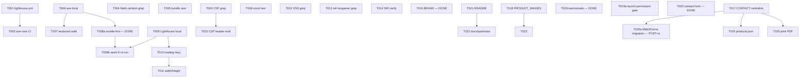

---

description: "Task list — Storefront Baseline (KrishiDakshina v1). Brownfield / reverse-engineered."
---

# Tasks: Storefront Baseline (KrishiDakshina v1)

**Feature Branch**: `001-storefront-baseline`

**Feature Directory**: [specs/001-storefront-baseline/](./)

**Inputs**:
- Spec: [spec.md](./spec.md)
- Plan: [plan.md](./plan.md)
- Research: [research.md](./research.md)
- Data model: [data-model.md](./data-model.md)
- Contracts: [contracts/csp.md](./contracts/csp.md) · [contracts/localstorage-schema.md](./contracts/localstorage-schema.md) · [contracts/postal-pincode-api.md](./contracts/postal-pincode-api.md) · [contracts/whatsapp-handoff.md](./contracts/whatsapp-handoff.md)
- Quickstart: [quickstart.md](./quickstart.md)
- Constitution: [.specify/memory/constitution.md](../../.specify/memory/constitution.md) (v2.1.0)

**Nature**: This feature is a **brownfield / reverse-engineered baseline**. The site is already shipped ([index.html](../../index.html), [index.css](../../index.css), [index.js](../../index.js)). Section A snapshots what already works; Section B enumerates outstanding v1 gaps (audit + CI + follow-ups from the plan's Complexity Tracking).

**Tests**: Not requested; TDD is not applicable to a shipped baseline. Section B audits produce report artifacts under `specs/001-storefront-baseline/audits/` — these are the "tests" for the outstanding work.

## Legend

- `- [x] DONE` — already shipped; **do not re-execute**. Included for baseline traceability only.
- `- [ ] Txxx` — outstanding v1 task to execute (Section B). Follows the mandated `- [ ] [TaskID] [P?] [Story?] Description` format.
- `[P]` — parallelizable (different files, no in-flight dependency).
- `Depends on: Txxx` — explicit predecessor.
- `Size: S/M/L` — subjective effort marker (no hour estimates per the request).
- **Principle refs**: **P-I** Accessibility · **P-II** Performance · **P-III** Static-First · **P-IV** Security · **P-V** Client-Only · **P-VI** Verifiable Releases.
- **Deferred item IDs** from the plan / constitution Sync Impact Report:
  - `P-VI FAIL` (Complexity Tracking, plan.md)
  - `P-I AUDIT`, `P-II BASELINE` (Complexity Tracking, plan.md)
  - `CONTACT_DETAILS_CENTRALIZATION` (constitution follow-up)
  - `BRAND_DOMAIN_RECONCILIATION` (**RESOLVED 2026-07-18** in constitution v2.1.0 — canonical brand is "KrishiDakshina", localStorage namespace migrated to `krishidakshina.*`)
  - `PRODUCT_IMAGES` (constitution follow-up, spec OQ-03)
  - `CONTACT_FORM_FATE` (**RESOLVED 2026-07-18** — Option C: WhatsApp handoff via `wa.me`, per Principle V clause 6(a); no new origin, no CSP change, no constitution amendment required)
  - `OQ-02` contact details real vs. placeholder · `OQ-04` testimonials **RESOLVED 2026-07-18 as placeholders** (new governance rule in constitution v2.1.0) · `OQ-05` contact-form fate **RESOLVED 2026-07-18** (Option C — WhatsApp handoff)

---

# Section A — Baseline (Already Shipped) — `[x] DONE`

Cited against the current tree. Each item names the file and line range that satisfies it so a reviewer can re-verify against the shipped code. **These are not re-executable tasks — they are the frozen baseline snapshot.**

## A-US1: Browse and Add to Cart (Priority: P1) — DONE

**Story goal**: Visitor lands on the home page, browses the 12-product grid, adds items to a cart drawer that persists in `localStorage`.

**Independent test (already passing manually per [quickstart.md](./quickstart.md))**: Load with empty `localStorage`, click `+` on any product, confirm badge shows `1`, drawer contains the line, reload and confirm persistence.

- [x] DONE A001 [US1] Semantic product grid with 12 `<article class="pcard">` cards — [index.html:252-452](../../index.html) (Cards 1–12, one per commented block)
- [x] DONE A002 [US1] Each card carries category badge, name, description, price/unit, ``, and keyboard-focusable `<button class="btn-add" aria-label="Add to cart">` — [index.html:257-268](../../index.html) (representative Card 1)
- [x] DONE A003 [US1] Product-image `error` fallback via delegated capture-phase listener → replaces `` with `data-fallback` emoji via `textContent` (no inline `onerror`, XSS-safe) — [index.js:11-30](../../index.js) (`applyImgFallback` + document-level error listener + catch-up pass)
- [x] DONE A004 [US1] Add-to-cart handler reads name/price/unit from card DOM, caps `qty ≤ MAX_QTY_PER_ITEM` (99), caps distinct lines ≤ `MAX_CART_ITEMS` (50) — [index.js:271-296](../../index.js) (`.btn-add` click handler)
- [x] DONE A005 [US1] Cart state persists to `krishidakshina.cart.v1` with schema validation on load (whitelisted keys, type checks, length caps, prototype-pollution-safe fresh-object copy) — [index.js:94-132](../../index.js) (`isValidCartItem` + hydration loop) and `saveCart()` at [index.js:134-137](../../index.js)
- [x] DONE A006 [US1] Cart badge shows total quantity across all lines; toggles `.has` class when non-zero — [index.js:157-160](../../index.js) (`renderCart`)
- [x] DONE A007 [US1] Card visuals + hover states use only external CSS (no inline `style="..."`) — [index.css:1-2](../../index.css) (file-header comment confirms the deliberate decision to keep styles external)

## A-US2: Adjust or Clear the Cart (Priority: P1) — DONE

**Story goal**: Inside the drawer, `+` / `-` per line, remove on qty→0, "Clear cart" button empties everything.

**Independent test**: With ≥ 2 lines at various qty, exercise `+`, `-`, and Clear; badge/drawer/`localStorage` remain consistent.

- [x] DONE A010 [US2] Cart drawer + overlay markup with `role="dialog" aria-modal="true" aria-label="Shopping cart"` — [index.html:731-736](../../index.html)
- [x] DONE A011 [US2] Drawer open/close handlers (`cartBtn` → open; `cartClose` + overlay click → close) with body-scroll lock — [index.js:139-149](../../index.js)
- [x] DONE A012 [US2] Per-line quantity controls built with `createElement` + `textContent` (no innerHTML for storage-derived name/unit) — [index.js:170-227](../../index.js) (row/info/ctrl/priceEl construction)
- [x] DONE A013 [US2] `+` / `-` handlers respect `MAX_QTY_PER_ITEM` cap; qty→0 removes the line via `delete cart[k]` — [index.js:239-253](../../index.js)
- [x] DONE A014 [US2] "Clear cart" empties in place via `for..of Object.keys(cart) { delete cart[k] }` (no full-replace of the reference) — [index.js:299-302](../../index.js) (`btnClearCart` handler)
- [x] DONE A015 [US2] Every drawer mutation calls `renderCart()` which calls `saveCart()` synchronously (mutations hit `localStorage` immediately) — [index.js:161](../../index.js) (`saveCart()` inside `renderCart`)

## A-US3: Provide Delivery Details (Priority: P1) — DONE

**Story goal**: Delivery form (Name, Phone, Address 1/2, Pincode, City, Notes) persists between visits; pincode → city lookup; opt-in geolocation.

**Independent test**: Fill valid values, reload, confirm re-hydration. Enter invalid phone/pincode, confirm submission is blocked.

- [x] DONE A020 [US3] Delivery-form markup inside cart drawer with `<label for=...>` per field, native `required` / `maxlength` / `autocomplete` / `pattern` — [index.html:748-780](../../index.html)
- [x] DONE A021 [US3] `isValidCustomer` strict validator + hydration from `krishidakshina.customer.v1` with per-field length checks — [index.js:339-378](../../index.js) (`isValidCustomer` + load block)
- [x] DONE A022 [US3] `saveCustomer()` writes back on every `input` event, slicing each field to its `MAX_*_LEN` cap — [index.js:380-391](../../index.js)
- [x] DONE A023 [US3] Regex validators `phone /^[6-9]\d{9}$/`, `pincode /^[1-9]\d{5}$/`; `validateForm()` toggles `.invalid` only after the user has typed (avoids all-red first-open) — [index.js:328-336](../../index.js) and [index.js:407-424](../../index.js)
- [x] DONE A024 [US3] Pincode lookup: fires only when pincode matches regex AND City is empty; uses `AbortController` to cancel in-flight requests; slices `District`/`State` before touching the DOM; failure is non-blocking — [index.js:432-461](../../index.js)
- [x] DONE A025 [US3] Geolocation button (opt-in only; never auto-requested); options `{enableHighAccuracy:true, timeout:8000, maximumAge:60000}`; captures `{lat,lng}` in-memory only (`geoLoc`, never persisted); permission-denied / unavailable / timeout paths each surface a non-blocking hint — [index.js:464-495](../../index.js)
- [x] DONE A026 [US3] `<output aria-live="polite">` sink for hints so screen readers announce the pincode auto-fill and geolocation state — [index.html:782](../../index.html) (`#delivHint output`) + [index.js:401-405](../../index.js) (`setHint`)

## A-US4: Place Order via WhatsApp (Priority: P1) — DONE

**Story goal**: With ≥ 1 cart line AND valid delivery form, "Order via WhatsApp" composes a plain-text message and opens `https://wa.me/<num>?text=...` in a new tab.

**Independent test**: Valid cart + valid form → click Order → new tab opens with the expected URL; decoded text contains header, all lines, customer name/phone/address; encoded length ≤ 3800.

- [x] DONE A030 [US4] `updateOrderBtnState()` disables `btnWaOrder` unless `cart` has items AND `validateForm()` passes — [index.js:427-430](../../index.js)
- [x] DONE A031 [US4] Message composition via pure string concatenation from validated state (no HTML injection surface) — [index.js:501-535](../../index.js)
- [x] DONE A032 [US4] `MAX_MSG_LEN = 3800` guard: oversized encoded messages are blocked with an inline error, no navigation — [index.js:319](../../index.js) (constant) + [index.js:537-540](../../index.js) (guard)
- [x] DONE A033 [US4] `window.open(url, '_blank', 'noopener,noreferrer')` — [index.js:542-545](../../index.js)
- [x] DONE A034 [US4] Optional geolocation pin appended as `https://maps.google.com/?q=<lat>,<lng>` when `geoLoc` is set — [index.js:524-526](../../index.js)
- [x] DONE A035 [US4] Order message layout matches [contracts/whatsapp-handoff.md](./contracts/whatsapp-handoff.md): header `🛒 *New Order – KrishiDakshina*`, customer block, delivery block with notes + map, per-line items, grand total — [index.js:513-533](../../index.js)

## A-US5: Contact the Business (Priority: P2) — DONE

**Story goal**: Contact section shows address / phone / email / hours / WhatsApp CTA plus a client-side-simulated message form (no backend).

**Independent test**: Submit contact form → spinner → new tab opens on `wa.me/919876543210` with a pre-filled enquiry message → no `fetch` / `XMLHttpRequest` fires from the page origin (verify via DevTools Network tab; only the external navigation to `wa.me` appears, and only in the newly opened tab).

- [x] DONE A040 [US5] Contact info cards (Address, Phone, Email, Hours) with icon + `<a href="tel:..." class="link-plain">` and `<a href="mailto:...">` — [index.html:588-618](../../index.html)
- [x] DONE A041 [US5] Direct WhatsApp CTA `<a class="btn-wa" target="_blank" rel="noopener noreferrer">` at [index.html:621-625](../../index.html)
- [x] DONE A042 [US5] `<form id="cf" novalidate>` with labelled inputs and required-marker copy — [index.html:634-676](../../index.html)
- [x] DONE A043 [US5] Submit handler is a **WhatsApp handoff** (spinner → build `💬 *New Enquiry – KrishiDakshina*` message → `window.open('https://wa.me/${WHATSAPP_NUMBER}?text=...')` → success toast "WhatsApp opened with your message") — [index.js:548-630](../../index.js) — **no `fetch()` / no `XMLHttpRequest`** from the page origin; reuses the already-declared `wa.me` handoff (P-V clause 6(a)). Superseded the earlier client-side simulation on 2026-07-18 as part of the OQ-05 resolution.

## A-US6: Navigate on Any Device (Priority: P2) — DONE

**Story goal**: Fixed navbar with smooth-scroll + active-section indicator; mobile hamburger < 768 px; floating scroll-to-top; fade-in-on-scroll; particle background; animated truck — all reduced-motion-safe.

**Independent test**: Resize < 768 px → hamburger appears; enable Reduce Motion → truck/particles/fade-in stop.

- [x] DONE A050 [US6] Semantic `<nav id="nav">` landmark with skip-free anchor list — [index.html:44-84](../../index.html)
- [x] DONE A051 [US6] Sticky-on-scroll navbar via `.on` class toggle at `scrollY > 40` — [index.js:55-58](../../index.js)
- [x] DONE A052 [US6] Active-section indicator: `scroll` listener sets `.cur` on the anchor whose section is under `scrollY + 110` — [index.js:62-67](../../index.js)
- [x] DONE A053 [US6] Mobile hamburger toggle + delegated close-on-link-click for `#mobNav a` (no inline `onclick="mClose()"` — CSP-safe) — [index.js:70-75](../../index.js)
- [x] DONE A054 [US6] Floating scroll-to-top button (`#top-btn`) appears at `scrollY > 300`; click → smooth scroll to top — [index.js:57 + 78](../../index.js)
- [x] DONE A055 [US6] `IntersectionObserver` at threshold `0.10` staggers `.fi` fade-in by `i * 90 ms`; unobserves after first hit (no thrash) — [index.js:81-89](../../index.js)
- [x] DONE A056 [US6] `@media (prefers-reduced-motion: reduce)` in CSS disables the truck animation, particle motion, and hover-motion effects — [index.css:240](../../index.css)
- [x] DONE A057 [US6] Mobile breakpoint at `@media(max-width:768px)` — [index.css:576](../../index.css)
- [x] DONE A058 [US6] Hero particles (20) use `randFloat()` (CSPRNG) — no `Math.random(` anywhere in production JS — [index.js:32-39](../../index.js) (`randFloat`) + [index.js:571-582](../../index.js) (particle loop)

## A-CC: Cross-cutting Security & Performance — DONE

- [x] DONE A060 Strict `<meta http-equiv="Content-Security-Policy">` with `default-src 'self'`, `script-src 'self'` (no `'unsafe-inline'`, no `'unsafe-eval'`), `connect-src 'self' https://api.postalpincode.in`, `frame-ancestors 'none'`, `object-src 'none'`, `form-action 'self'`, `base-uri 'self'` — [index.html:24](../../index.html)
- [x] DONE A061 `<meta name="referrer" content="strict-origin-when-cross-origin">` — [index.html:25](../../index.html)
- [x] DONE A062 Font Awesome 6.5.0 pinned with SRI `integrity`, `crossorigin="anonymous"`, `referrerpolicy="no-referrer"` — [index.html:29-32](../../index.html)
- [x] DONE A063 Google Fonts uses `preconnect` hints and `display=swap` — [index.html:34-36](../../index.html)
- [x] DONE A064 `'use strict'` at top of script; all handlers registered via `addEventListener` (no inline `onclick=`, no inline ``** block inside `index.html` (JSON in a non-executable script tag is CSP-safe and needs **no** `unsafe-inline`). Update [index.js:92](../../index.js) (`WHATSAPP_NUMBER`) to read `JSON.parse(document.getElementById('site-config').textContent)`. Update the four duplicated locations in `index.html`: [line 601](../../index.html) address, [line 608](../../index.html) tel, [line 615](../../index.html) email, [line 622](../../index.html) WhatsApp CTA URL. **Note on email**: the current address `hello@gutpoint.com` intentionally retains the old brand string as a placeholder per constitution v2.1.0 Governance; it is preserved verbatim and will be updated when the owner provides the production email. **Principle**: P-V clause 4 (constitutional follow-up); Governance. **Deferred ID**: `CONTACT_DETAILS_CENTRALIZATION`, spec `OQ-02`. **Acceptance**: post-change grep for `919876543210` returns exactly ONE hit (the JSON block); same for `hello@gutpoint.com` (or its owner-supplied replacement) and `+91 98765 43210`. **Test evidence**: post-change diff + grep output pasted into the PR description. **Size**: M. **Depends on**: owner-supplied contact values. **[BLOCKED-DECISION]**: owner input required (see [spec.md `OQ-02`](./spec.md)).
- [ ] T018 [P] [US1] `PRODUCT_IMAGES` — source 12 photos at 600 × 600 optimized to ≤ 200 KB each, saved as `product_images/{tomato,eggs,spinach,bread,mango,milk,carrot,yogurt,brown-rice,avocado,mixed-nuts,turmeric}.jpg` (or serve AVIF/WebP with a JPG fallback via `<picture>` — see stretch task T023). File names MUST match the 12 `` references at [index.html:257-452](../../index.html). Verify the emoji fallback still triggers if any image is later removed (delete one file, hit-refresh the page, confirm `data-fallback` shows). **Principle**: P-II. **Deferred ID**: `PRODUCT_IMAGES`, spec `OQ-03`. **Acceptance**: [spec.md `FR-020`, `FR-024`, `FR-026`](./spec.md); [spec.md `SC-002`](./spec.md) (≤ 200 KB each). **Test evidence**: `ls -lS product_images/` output pasted into the PR + one Lighthouse "Properly size images" audit at score 100. **Size**: L (asset sourcing). **Depends on**: none — touches a new folder, no source-file conflict. **[BLOCKED-DECISION]**: asset provider (see [spec.md `OQ-03`](./spec.md)).
- [x] T019 [US5] **DONE (2026-07-18) — testimonials confirmed placeholders**. The three testimonials in [index.html:494-521](../../index.html) (Priya Sharma, Rahul Mehta, Ananya Iyer) are confirmed placeholders per constitution v2.1.0 (OQ-04 RESOLVED). They are already labeled as example content in a source-file comment in `index.html`. **Governance follow-up**: production launch is BLOCKED from publishing these testimonials until real ones are gathered per the new constitution v2.1.0 "Testimonial permission requirement" governance rule — either signed, written permission from each named customer on file, OR replacement with genuinely permitted testimonials. **Principle**: Governance / privacy hygiene (constitution v2.1.0 new governance rule). **Deferred ID**: spec `OQ-04` — RESOLVED as placeholders. **Acceptance met**: source-file comment labels them as example content; a follow-up task (**T019a below**) tracks the production-launch permission gate. **Test evidence**: source comment in `index.html` + constitution v2.1.0 Sync Impact Report entry.
- [ ] T019a [US5] **Production-launch gate** — before publishing the site with the placeholder testimonials replaced by production copy, either (a) obtain and file documented, written permission from each named customer under `docs/testimonial-permissions.md`, OR (b) replace them with genuinely permitted testimonials. Until one of those is done, the placeholder set (Priya Sharma, Rahul Mehta, Ananya Iyer) MUST retain its "example content" source comment and MUST NOT be presented as real testimonials in production. **Principle**: constitution v2.1.0 "Testimonial permission requirement". **Deferred ID**: spec `OQ-04` follow-up. **Acceptance**: either `docs/testimonial-permissions.md` exists with signed permissions, OR the visible testimonials in `index.html` have been swapped for permitted ones. **Test evidence**: the permissions file OR the diff replacing the copy. **Size**: S. **Depends on**: none. **[BLOCKED-DECISION]**: needs real customer testimonials or a decision to defer the section entirely.

**Checkpoint B5**: Brand is single-sourced (T016 DONE in constitution v2.1.0); contact details are single-sourced once owner supplies production values (T017); product images either shipped or the emoji fallback is explicitly ratified; testimonials are labeled as example content (T019 DONE) and the production-launch gate (T019a) tracks the permission requirement.

---

## Phase B6 — Contact-Form Decision (P-V clause 6)

**Purpose**: Resolve the single largest v1 open question that's not "polish": what happens when a visitor submits the visible contact form? Historically a client-side simulation (former A043); on 2026-07-18 migrated to a WhatsApp handoff consistent with the order flow (P-V clause 6(a)).

- [x] **DONE 2026-07-18** T020 [US5] Fate of the contact form ([spec.md `OQ-05`](./spec.md)) — **Option C selected: WhatsApp handoff** (analogous to the order flow at A034/A035). Rationale: (1) reuses the already-declared `wa.me` origin — no new origin, no CSP change, no constitution amendment required, since Principle V clause 6(a) explicitly permits "a WhatsApp handoff consistent with #4"; (2) WhatsApp's native phone-number verification acts as the anti-spam mechanism the governance rule asks for; (3) consistent UX with the primary order CTA. **Implementation**: contact form handler rewritten to build a `💬 *New Enquiry – KrishiDakshina*` message and open `https://wa.me/${WHATSAPP_NUMBER}?text=...` in a new tab — [index.js:548-630](../../index.js). Inline `#cf-err` error region replaces the previous `alert()` call. Button icon updated to `fa-brands fa-whatsapp` and label to "Send via WhatsApp" — [index.html:648-654](../../index.html). Success toast reworded from "Message sent!" to "WhatsApp opened with your message — press Send there to reach us." **Principle**: P-V clause 6(a). **Deferred ID**: spec `OQ-05`, `CONTACT_FORM_FATE` — both RESOLVED.
- [ ] T020a [US5] **[POST-v1]** Evaluate migration to a real-inbox third-party form endpoint (Web3Forms / Formspree / Netlify Forms / Basin / Formsubmit). **Trigger**: owner requests an inbox trail for enquiries independent of WhatsApp. **Constitutional cost** (per constitution v2.1.0 "Contact-form migration procedure"): ALL of (a) a **constitution MINOR amendment** adding the new endpoint origin to the runtime allow-list, (b) a **CSP allow-list amendment** in [index.html](../../index.html) — add the endpoint origin to `form-action` and, if the endpoint's response is fetched via JS, to `connect-src`; add an SRI hash for any third-party script the provider requires, (c) an **anti-spam mechanism** whose provider (if any) is itself listed in the constitution — minimum viable is a honeypot input (no origin cost); a CAPTCHA provider is a further origin addition. **Recommended provider (pre-audit shortlist)**: **Web3Forms** — cleanest CSP footprint (`https://api.web3forms.com`), free tier 250 msg/mo, honeypot supported natively, no signup-blocked domain. **Fallbacks**: Formspree (well-established but 50 msg/mo free-tier ceiling), Formsubmit (no-signup but adds a captcha-redirect UX). **Runtime shape**: keep the current form markup; on submit, `fetch(endpoint, { method: 'POST', body: FormData })`; on non-OK, fall back to the existing WhatsApp handoff (best-of-both). **Acceptance**: constitution diff at v2.2.0 (or later); CSP diff; honeypot present; DevTools Network capture of a real submit reaching the endpoint; success email received at the owner's inbox. **Test evidence**: preview URL + Network log + email screenshot. **Size**: M. **Depends on**: T017 (contact details finalized so the endpoint is configured against the real owner address), owner request to trigger. **[BLOCKED-DECISION]**: needs owner request; not required for v1.

**Checkpoint B6**: The contact-form behavior is ratified as a WhatsApp handoff (T020 done). A future migration to a third-party inbox endpoint is scoped as T020a with the full constitution + CSP paper trail already itemized.

---

## Phase B7 — Documentation

**Purpose**: The constitution's Governance section says a `README.md` and `docs/quickstart.md` MUST be authored and MUST cite the constitution. Neither exists at the repo root today.

- [ ] T021 [P] Author `README.md` at the repository root. Contents: one-liner about the KrishiDakshina site, "how to serve locally" (`python -m http.server 8000` or `npx serve .`), deployment note (`git push` → GitHub Pages auto-publishes from the default branch via [CNAME](../../CNAME)), and a "Governance" section linking to [.specify/memory/constitution.md](../../.specify/memory/constitution.md) and [specs/001-storefront-baseline/spec.md](./spec.md). **Principle**: Governance ("Runtime guidance"). **Deferred ID**: constitution Sync Impact Report — "README.md / docs/quickstart.md — not present in repository; propagate when authored." **Acceptance**: file exists at `README.md`; passes T001's link-check on the new internal links. **Test evidence**: the file itself + green CI. **Size**: S. **Depends on**: none (canonical brand already resolved in constitution v2.1.0).
- [ ] T022 [P] Confirm [specs/001-storefront-baseline/quickstart.md](./quickstart.md) already covers what a `docs/quickstart.md` would cover. If so, add a one-line pointer in `README.md` (task T021) and record "no separate `docs/quickstart.md` needed for v1 — see feature quickstart" in the T021 PR description. If NOT, author `docs/quickstart.md` citing the constitution per its Governance advisory. **Principle**: Governance. **Deferred ID**: constitution Sync Impact Report same as T021. **Acceptance**: either the pointer added or `docs/quickstart.md` exists and cites the constitution. **Test evidence**: T021's PR + the reviewer's confirmation. **Size**: S. **Depends on**: T021.

**Checkpoint B7**: The repo has entry-point docs; no more implicit tribal knowledge.

---

## Phase B8 — Optional / Stretch (NOT v1 blockers)

Marked explicitly as stretch. Do not gate v1 release on these — they are queued for `/speckit.plan` on a follow-up feature branch.

- [ ] T023 [P] [US1] **Stretch** — migrate the 12 `` tags to `<picture>` with AVIF + WebP + JPG fallback. **Principle**: P-II. **Deferred ID**: [spec.md `FR-020`](./spec.md) ("AVIF/WebP preferred with JPEG/PNG fallback"). **Acceptance**: post-change Lighthouse "Serve images in modern formats" audit ≥ 90. **Test evidence**: appended reading in `audits/perf-<date>.md`. **Size**: M. **Depends on**: T018 (need the JPG masters first).
- [ ] T024 [P] [US1] **Stretch** — extract product data (name, category, description, price, unit, badge, filename, fallback emoji) into a separate `<script type="application/json" id="products">` block **or** a `products.json` file, then have `index.js` render the grid from the data. Reduces the risk of a typo in one of 12 near-identical `<article>` blocks. **Principle**: P-III (minimalism, DRY) + P-IV (still XSS-safe via `textContent` per A012 pattern). **Deferred ID**: none (author's judgment call). **Acceptance**: grid renders identically to today; no new CSP entries needed; the JSON block is `application/json` (non-executable). **Test evidence**: side-by-side screenshot + a follow-up Lighthouse run. **Size**: L. **Depends on**: T017 (same "put data in a script tag" pattern; land the site-config block first).
- [ ] T025 [P] [US4] **Stretch** — a "Save order" print / PDF fallback path for visitors who can't reach WhatsApp (out-of-country visitors, WhatsApp regional bans, corporate blocklists). Trigger a print stylesheet + `window.print()` OR a plain-text `download` attribute on an `<a href="data:text/plain,...">`. **Principle**: P-I + resilience ([spec.md `SC-010`](./spec.md) style). **Deferred ID**: none. **Acceptance**: keyboard-reachable button in the drawer footer produces a printable order summary containing the same fields as the wa.me message. **Test evidence**: manual verification screenshot. **Size**: M. **Depends on**: T017 (WhatsApp number + brand freeze).

---

## Dependencies & Execution Order (Section B)

### Phase Order

1. **B1 (CI Gates)** — first, because everything downstream benefits from the gates being live.
2. **B2 (a11y)** + **B3 (perf)** + **B4 (security)** — parallel work streams, each producing audit artifacts. Best run in the order shown so a11y fixes land before the manual keyboard pass and before the "after" Lighthouse.
3. **B5 (content/brand)** — T016 is DONE (constitution v2.1.0 landed the brand rename); T017 depends on owner-supplied contact values; T018 / T019 / T019a are parallel.
4. **B6 (contact form)** — T020 is DONE (2026-07-18, WhatsApp handoff); T020a (Web3Forms migration) is post-v1 and gated on an owner request + T017.
5. **B7 (docs)** — can now proceed (brand freeze already landed).
6. **B8 (stretch)** — after v1 ships.

### Parallel Opportunities

- **T001 + T003 + T004 + T005** are all workflow-file edits — trivially parallel; a single PR is fine but they're independent.
- **T006 + T008 + T009** are read-only audits against the shipped code — full parallel.
- **T012 + T013 + T014** are pure grep + review — full parallel.
- **T018 + T019a** touch new files or a small isolated section — parallel with the T017 chain.
- **T023 + T024 + T025** are stretch items with different owners possible — parallel among themselves once T017/T018 land.

### Serial Constraints (do NOT parallelize)

- **T010 and T011** both edit `index.html` — sequential.
- **T016 and T017** — T016 is DONE; T017 remains dependent on owner-supplied contact values. No sequencing concern between them anymore.
- **T009 → T010 → T011** is a "measure, fix, re-measure" chain — sequential.

---

## Implementation Strategy

### MVP-first is not applicable

This is a brownfield baseline: the entire "MVP" (US-1 through US-6) is already shipped in Section A. The MVP-first-slice equivalent for Section B is **Phase B1 alone**: land the five CI gates, then ship v1 with the CI enforcing the constitution. Phases B2–B7 fill in the audit trail; Phase B8 waits for v1.1.

### Suggested v1 execution slice

1. **v1.0 release blockers**: T001 – T005 (CI gates) + T006 – T009 (baseline audits) + T017 (contact freeze, pending owner input). That is 10 tasks (T016 and T020 are already DONE; T019 is DONE). Smallest set that closes P-VI FAIL, produces the audit artifacts P-I and P-II expect, and eliminates the remaining content-drift risk the constitution's Sync Impact Report still flags.
2. **v1.0 nice-to-have**: T010 – T014 (perf polish + security-audit paperwork) + T018 (product images) + T019a (testimonial launch gate) + T021 – T022 (docs). Nine more tasks, none of them structural.
3. **v1.0 decisions to unblock**: T015 (host migration eval — decision recorded, not executed).
4. **Post-v1 backlog**: T020a (Web3Forms/third-party form endpoint migration — owner-triggered) + T023 – T025 (stretch).

### Incremental Delivery

Each Section-B task is independently mergeable. Landing T001 alone already meaningfully improves the release posture. Landing all of Phase B1 constitutes the single biggest constitution-compliance win available.

---

## Section B totals

- **Total tasks tracked**: 29 (T001 – T025 + T019a + T020a + T008a + T008b).
- **Completed since baseline**: 4 (T016, T019, T020, T008a — all closed on 2026-07-18).
- **Outstanding tasks (unchecked)**: 25 (T001 – T008, T008b, T009 – T015, T017, T018, T019a, T020a, T021 – T025).
- **v1 release blockers (Phases B1–B5, unchecked)**: 19 (T001 – T008, T008b, T009 – T015, T017, T018, T019a).
- **v1 decisions with recorded outcomes (Phase B4)**: 1 (T015).
- **Documentation (Phase B7)**: 2 (T021, T022).
- **Post-v1 / stretch (Phase B6 T020a + Phase B8)**: 4 (T020a, T023 – T025).
- **[BLOCKED-DECISION] tasks (need owner input)**: 5 (T017, T018, T019a, T020a, and the go/no-go inside T015).
- **Parallelizable `[P]` tasks**: 15 (T001, T002, T003, T004, T005, T006, T008, T009, T012, T013, T014, T018, T021, T022, T023, T024, T025 — full count of the `[P]` markers above).

---

## Notes

- `[P]` = different files, no dependencies. **NEVER** parallelize edits to `index.html` or `index.js`.
- `[Story]` labels use the spec's US identifiers (US1 – US6); tasks that are pure CI or documentation carry no `[US*]` label per the template.
- Every Section-B task cites (a) the principle it satisfies, (b) the acceptance criterion or file to touch, and (c) any deferred item ID from the plan / constitution Sync Impact Report.
- Section A is **frozen evidence**, not work-in-flight. Removing anything from Section A without also removing the corresponding baseline behavior from the source files is a spec/plan drift and requires an amendment PR.
- Cross-links to design docs: [plan.md `#complexity-tracking`](./plan.md) enumerates the same five deferred items this file operationalises; [contracts/csp.md](./contracts/csp.md) governs T003 + T015; [contracts/whatsapp-handoff.md](./contracts/whatsapp-handoff.md) governs T025.
